# Automated Story Illustrator (ASI)

[](https://opensource.org/licenses/MIT)
[](https://www.python.org/downloads/)
[](https://github.com/comfyanonymous/ComfyUI)
[](https://lmstudio.ai/)

**Automated Story Illustrator (ASI)** is an end-to-end local generative pipeline and interactive web dashboard that transforms raw text stories and novels into fully illustrated, publication-grade digital editions—including High-Resolution Print PDFs, Fixed-Layout FXL EPUB 3.0, Reflowable EPUBs, and interactive web readers.

Designed specifically for consumer-grade GPU setups (such as an NVIDIA GeForce RTX 3070 with 8GB VRAM), ASI implements a strict **three-phase decoupled architecture** that separates literary analysis from diffusion rendering, guaranteeing zero GPU memory contention or VRAM Out-of-Memory (OOM) crashes.

---

## Complete End-to-End Walkthrough ("The Clockwork Duel")

Below is a complete visual walkthrough of the 6-stage pipeline executing *The Clockwork Duel*, showcasing multi-character tracking, chronological timeline modifications, wardrobe changes, the **Prompt Context Audit System**, and diffusion image rendering via ComfyUI.

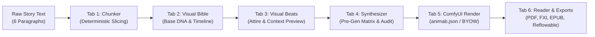
```mermaid
flowchart LR
    A["Raw Story Text<br/>(6 Paragraphs)"] --> B["Tab 1: Chunker<br/>(Deterministic Slicing)"]
    B --> C["Tab 2: Visual Bible<br/>(Base DNA & Timeline)"]
    C --> D["Tab 3: Visual Beats<br/>(Attire & Context Preview)"]
    D --> E["Tab 4: Synthesizer<br/>(Pre-Gen Matrix & Audit)"]
    E --> F["Tab 5: ComfyUI Render<br/>(animab.json / BYOW)"]
    F --> G["Tab 6: Reader & Exports<br/>(PDF, FXL EPUB, Reflowable)"]
```

---

### Tab 1: Deterministic Story Chunker
Divide your manuscript or raw story text into scene-length paragraphs with smart word count limits and boundary preservation.
- **Inspect & Adjust**: Review each chunk (`chunk_000` through `chunk_005`), check word counts, and verify clean scene division.
- **Drag-and-Drop**: Drop any `.txt` or `.md` file into the dashboard to create projects instantly.

| Creating New Project | Loaded Story Text | 6 Sliced Chunks |
| :---: | :---: | :---: |
| 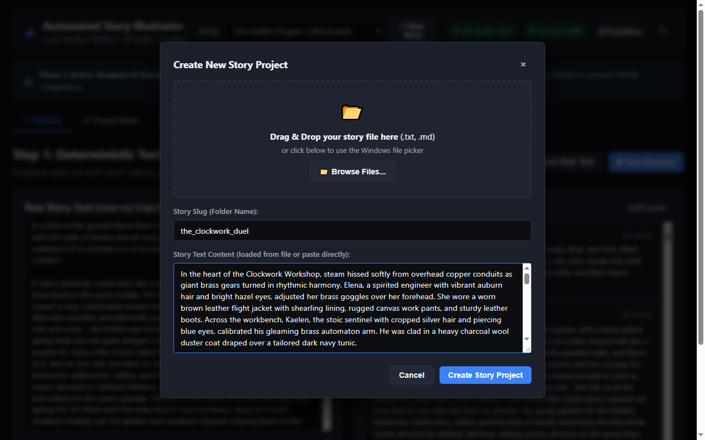 | 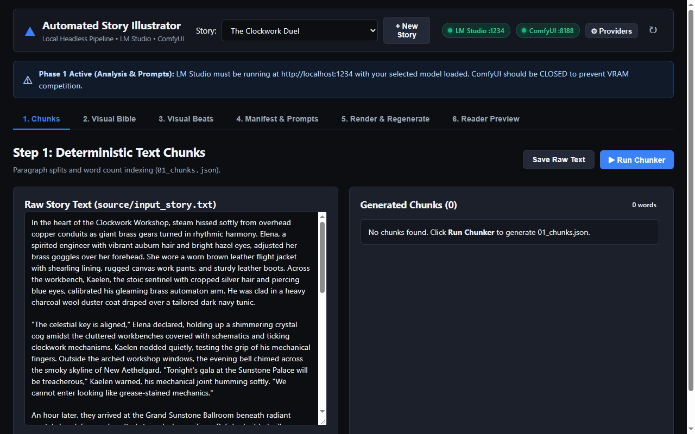 | 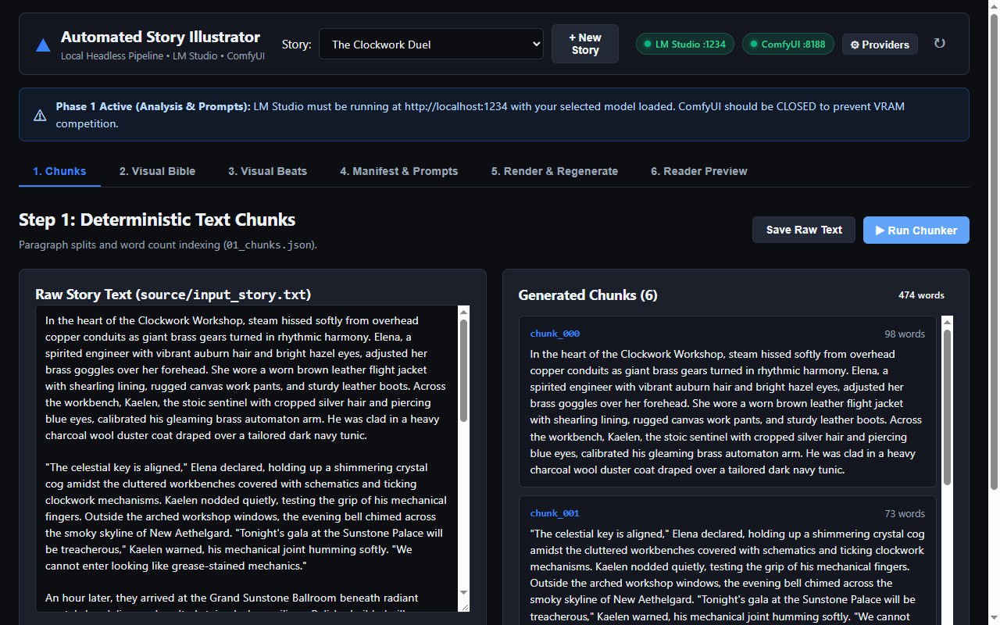 |

---

### Tab 2: Visual Bible Extraction with Timeline Continuity
Extract comprehensive character profiles, setting environments, and global art motifs using your local LLM (e.g., `gemma-4-e4b-it-qat` via LM Studio).
- **Immutable Base DNA**: Extracts persistent physical traits (facial structure, hair color, eye color, distinctive features like prosthetic limbs) that stay consistent across the entire story.
- **Chronological Timeline Modifications**: Captures chronological physical changes tagged by chunk ID (e.g. `Physical Change [chunk_004]: permanent jagged crimson scar across left cheek`). Early scenes will not leak this scar.
- **Wardrobe Timelines**: Tracks costume progression across scenes (e.g., workshop overalls $\rightarrow$ gala gown $\rightarrow$ combat armor).

| Model Configuration | Extracted Bible Profiles | Timeline Continuity Profiles & Badges |
| :---: | :---: | :---: |
| 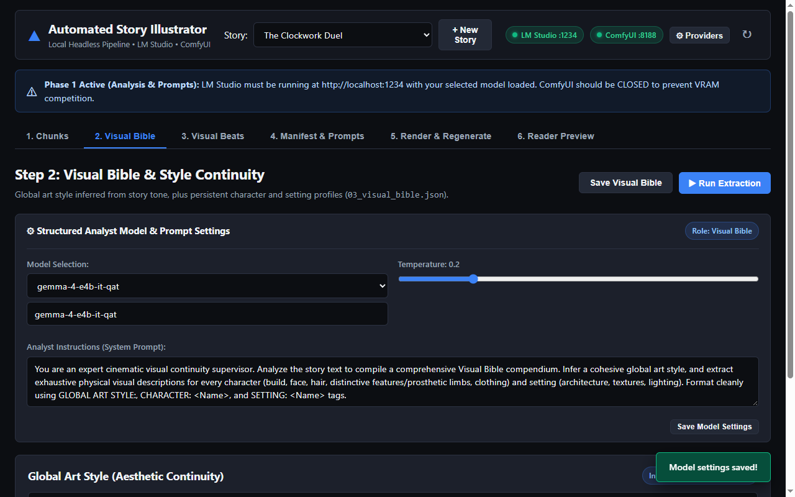 | 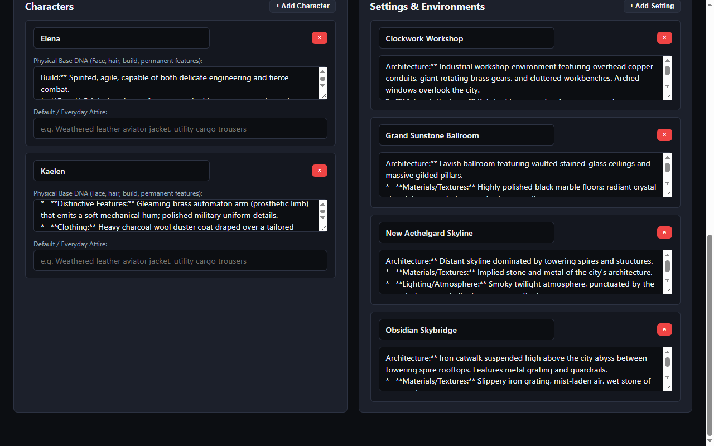 | 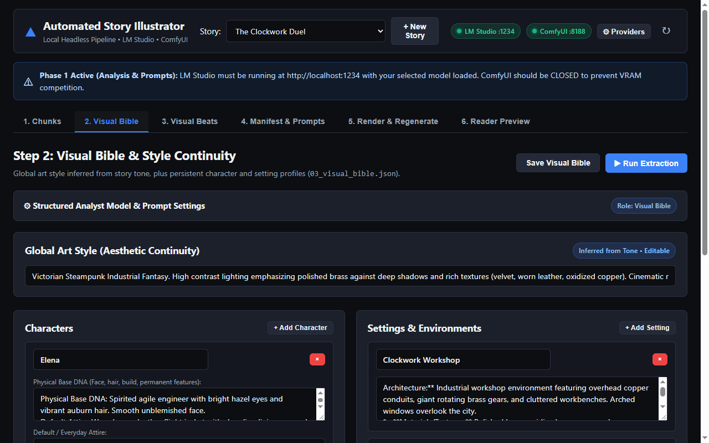 |

---

### Tab 3: Visual Beat Selection, Scene Attire Overrides & Context Previews
Scan through each chunk to pinpoint the single most dramatic, illustrative moment.
- **Narrative Beat Selection**: The LLM analyzes each segment to identify active characters, primary location, mood, and focal action.
- **Scene-Specific Attire**: Override wardrobes for specific narrative scenes (e.g. `Elena: emerald green velvet gala gown with silver embroidery; Kaelen: midnight-blue military dress uniform`).
- **Live Beat Context Preview (`[👁 Preview Prompt Context]`)**: Inspect the exact resolved context payload—including dynamic live edits to attire or framing—before saving.

| Narrative Director Ready | Selected Beats with Attire | Live [👁 Preview Prompt Context] Buttons |
| :---: | :---: | :---: |
| 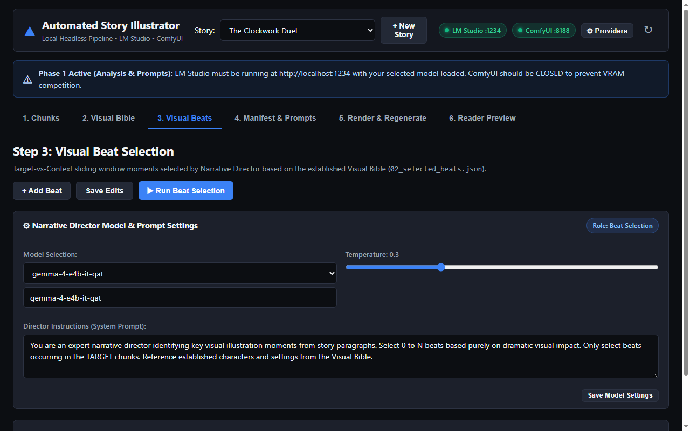 | 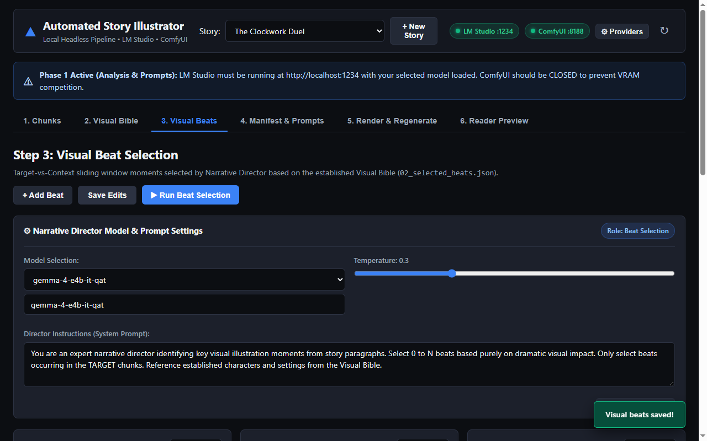 | 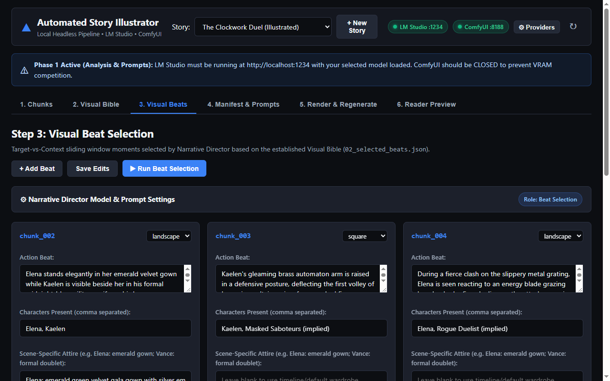 |

---

### Tab 4: Prompt Synthesis & Pre-Generation Context Review Matrix
Blend entity profiles from the Visual Bible with the dynamic action of Visual Beats into rich 5-element diffusion prompts.
- **Pre-Generation Context Review Matrix**: Prior to prompt synthesis, review character Base DNA, active timeline tags, scene attire overrides, and setting environment details across all pending beats.
- **Continuity Badges**: Color-coded badges (`🏛 Setting`, `👤 Character`, `👗 Attire`, `✨ Mod`, `⏳ Future Mod`) appear on each card.
- **Post-Generation Context Audit (`[🔍 Context Audit]`)**: Inspect the exact context payload that was dispatched to the LLM for any generated prompt.

| Pre-Gen Review Matrix | Prompt Synthesizer Config | Manifest Cards with Context Badges & Audit |
| :---: | :---: | :---: |
| 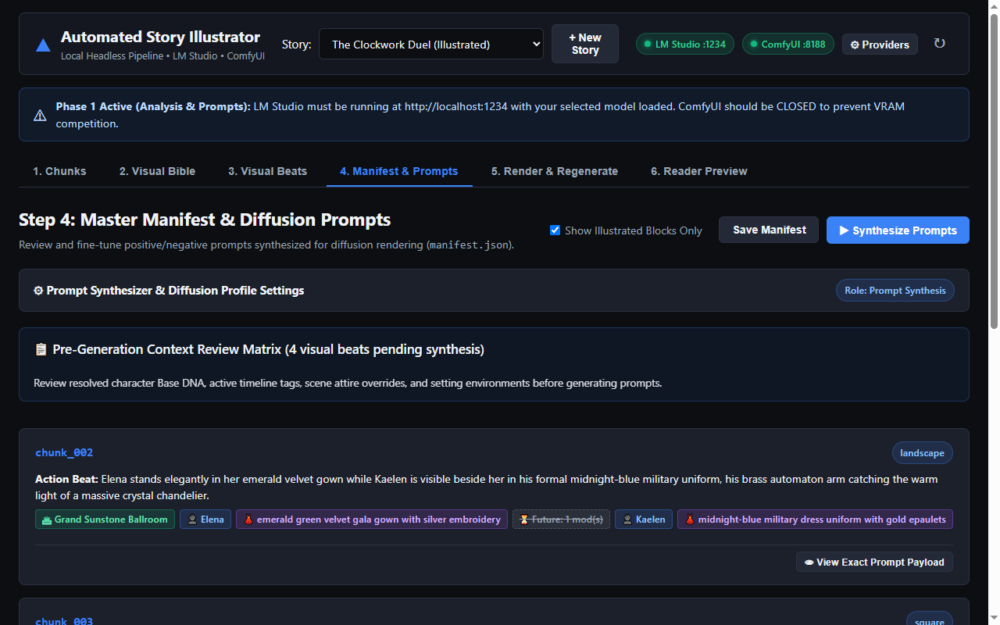 | 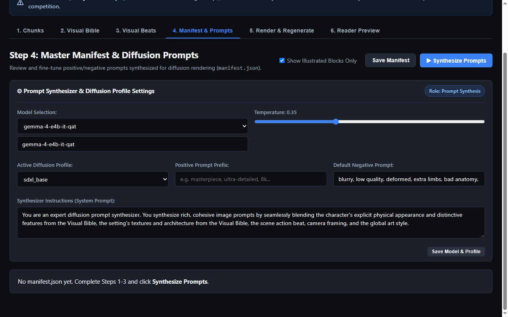 | 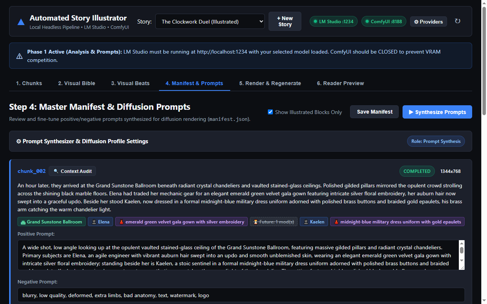 |

---

### The Prompt Context & Visual Bible Audit Inspector Modal

Clicking any **`[👁 Preview Prompt Context]`** or **`[🔍 Context Audit]`** button opens a wide, centered 3-tab inspector modal (`#modalPromptContext`) providing complete visibility into LLM prompts:

1. **📖 Visual Bible Audit Tab**:
   - **Resolved Setting**: Architectural details, textures, lighting ambience, and era.
   - **Resolved Characters**: Base DNA, active timeline modifications, future excluded modifications (with source chunk tags), resolved attire, and attire source (`Scene Override` vs `Timeline / Wardrobe`).
   - **Global Art Style & Action Beat**: Framing, camera angle, and style directives.
2. **🤖 Raw LLM Messages Tab**:
   - Exact **System Prompt** (synthesizer role instructions) with 1-click clipboard copy.
   - Full **User Prompt** (complete compositional payload sent to the LLM) with 1-click clipboard copy.
3. **⚙ Scene & Model Specs Tab**:
   - Synthesizer model identifier, temperature, active diffusion profile (`sdxl_base`), aspect ratio dimensions, and negative prompt.

| Modal Tab 1: Visual Bible Audit (`chunk_002`) | Modal Tab 2: Raw LLM Messages (System & User) | Modal Tab 3: Scene & Model Specs |
| :---: | :---: | :---: |
| 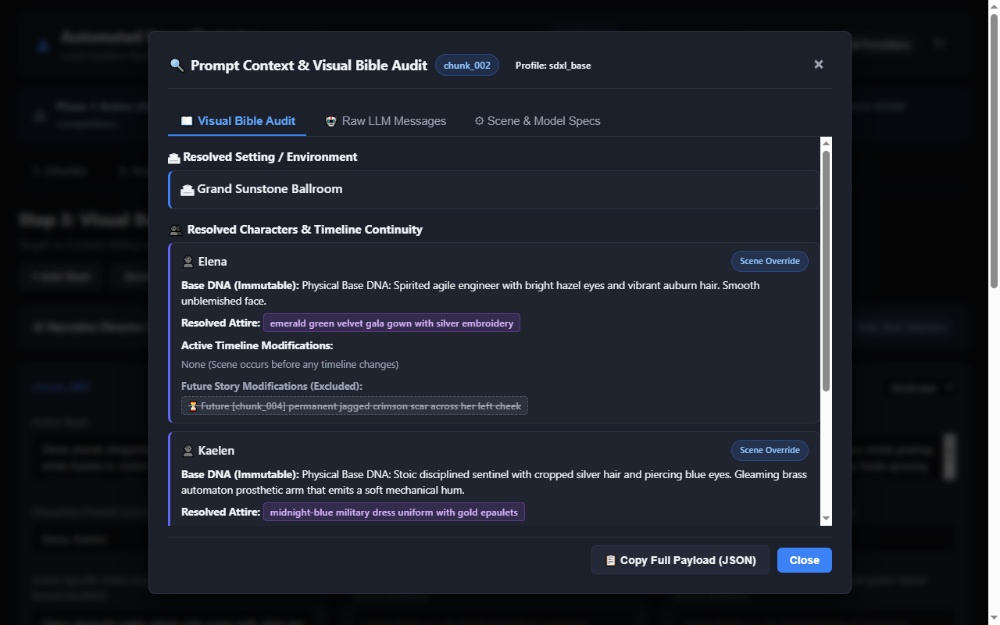 | 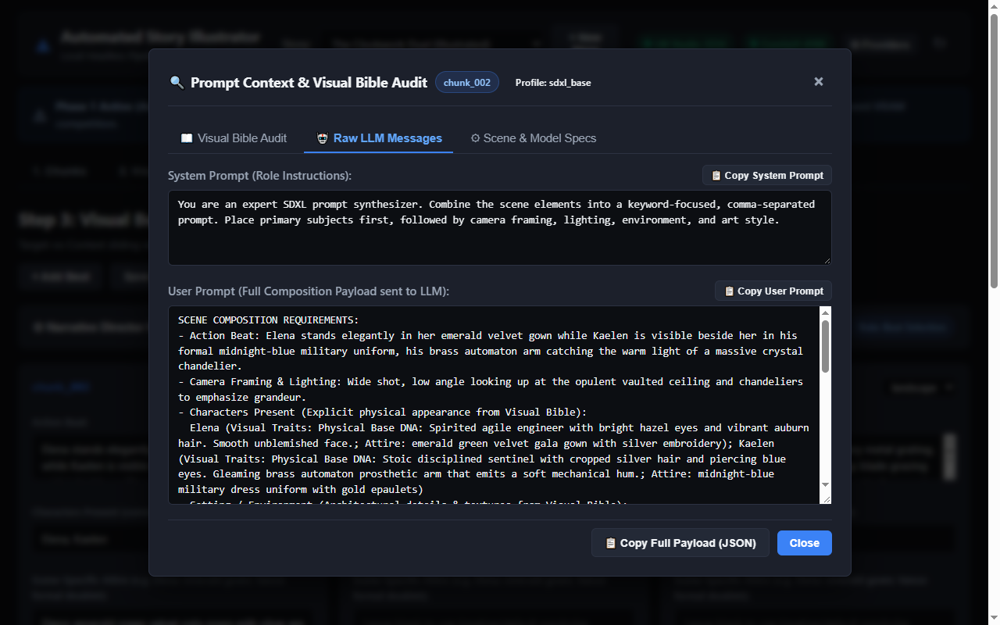 | 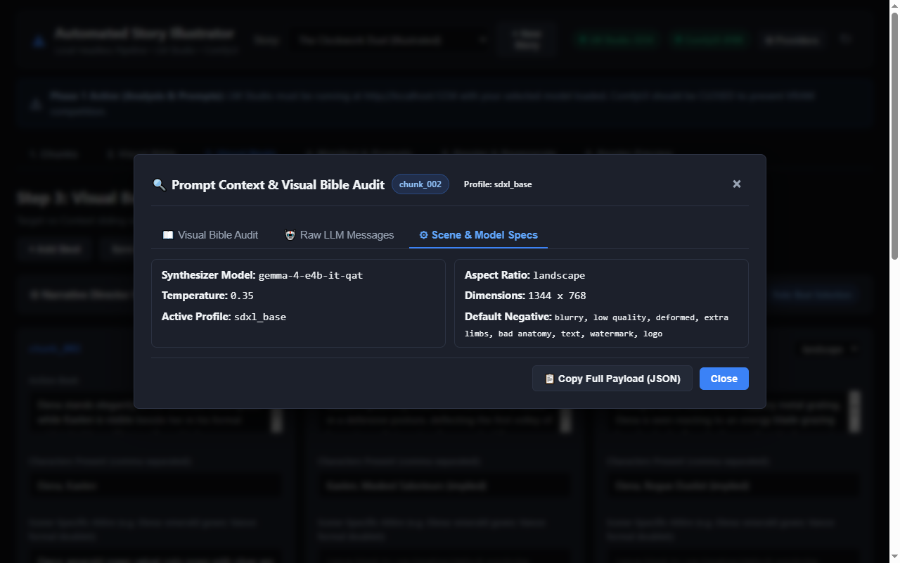 |

#### Mathematical Proof of Chronological Timeline Isolation

The audit modal provides mathematical proof of chronological timeline isolation:

| Beat | Target Scene | Elena Physical Timeline Status | Elena Attire Resolution |
| :--- | :--- | :--- | :--- |
| **`chunk_002`** | Ballroom Gala | **Smooth unblemished face**<br/>`⏳ Future [chunk_004] permanent jagged crimson scar across her left cheek` (Excluded) | **`emerald green velvet gala gown with silver embroidery`**<br/>Source: `Scene Override` |
| **`chunk_005`** | Skybridge Dawn | **`✨ permanent jagged crimson scar across her left cheek`** (Active)<br/>`Future Modifications: None` | **`reinforced black tactical combat armor with padded pauldrons and utility belts`**<br/>Source: `Scene Override` |

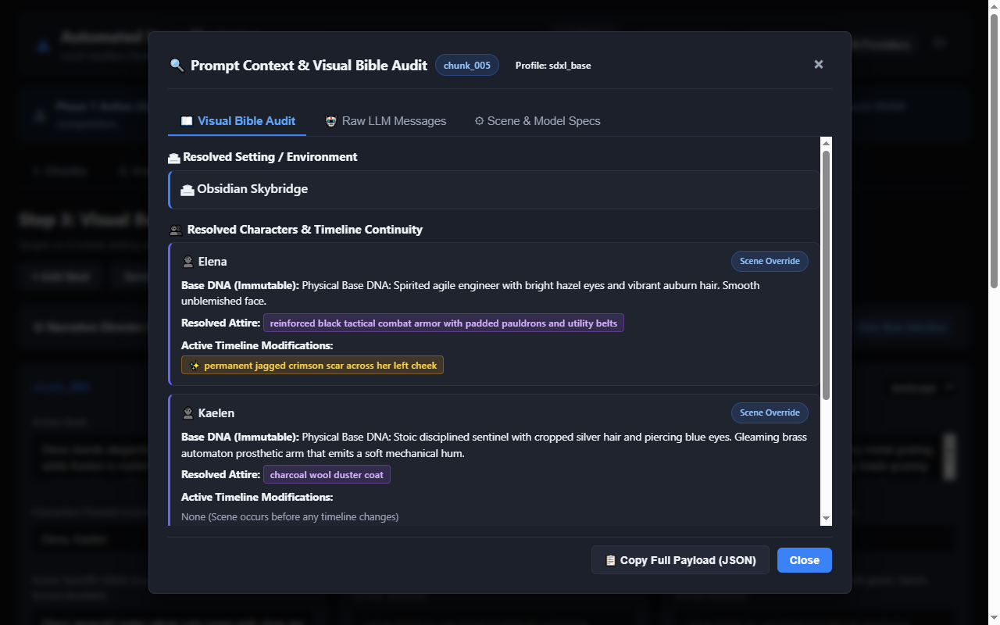

---

### Tab 5: Headless ComfyUI Batch Rendering & Tweak Modal
Dispatch prompts directly to ComfyUI headless via WebSocket and monitor real-time generation progress.
- **Multi-Workflow Support**: Render using any ComfyUI workflow (`animab.json`, `sdxl_base.json`, `flux_dev.json`, or your own custom BYOW workflow). Images are saved into isolated workflow directories.
- **Tweak & Context Inspection**: Inspect generated illustrations, mass-select scenes with checkboxes for batch regeneration, or click **`[🔍 Context]`** to audit the exact Visual Bible context. The Tweak Modal includes an embedded **`[🔍 View Context]`** button for quick reference during prompt adjustments.

| ComfyUI Workflow animab.json | 4 Rendered Illustrations Completed | Gallery Cards with [🔍 Context] Buttons |
| :---: | :---: | :---: |
| 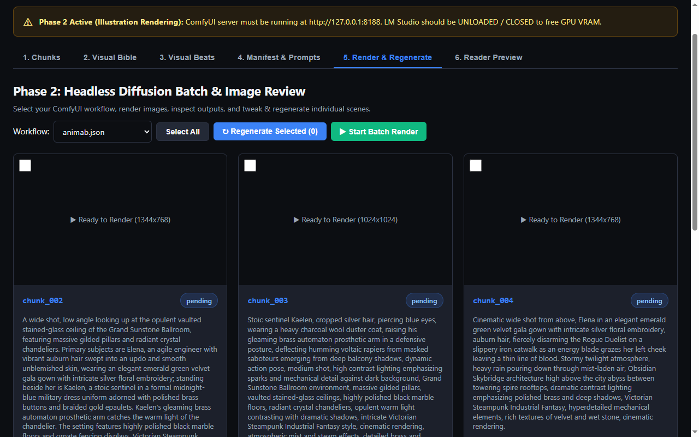 |  | 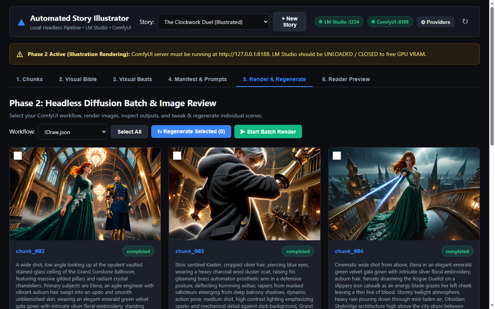 |

---

### High-Resolution Render Outputs (Anima Workflow)

The 4 scenes rendered by ComfyUI using the `animab.json` diffusion workflow in *The Clockwork Duel*:

| `chunk_002`: Elena in Emerald Gala Gown & Kaelen in Ballroom | `chunk_003`: Kaelen Deflecting Saboteurs with Automaton Arm |
| :---: | :---: |
|  |  |
| **`chunk_004`: Duel on Obsidian Skybridge (Energy Blade Wound)** | **`chunk_005`: Elena in Tactical Armor with Scar at Dawn** |
|  |  |

---

### Tab 6: Reader Preview & Retailer Ebook Exports
Read your fully illustrated book in an interactive dual-page or scroll reader, compare workflow renders side-by-side, and export commercial-grade digital publications.
- **Interactive Reader**: Read your illustrated story with dialogue quote highlighting (`<strong class="q">`) and inline full-resolution illustrations.
- **Workflow Comparison**: Switch between different workflow image sets on the fly to compare art styles across the entire book.
- **Retailer-Ready Exports**:
  - **📄 High-Resolution Print PDF**: Vector typography, running headers, page numbers, dialogue highlighting, uncompressed full-res image plates, and document catalog metadata.
  - **📖 Fixed-Layout FXL EPUB 3.0**: Pre-paginated EPUB 3.0 package with Kindle-specific metadata (`rendition:layout="pre-paginated"`, `fixed-layout="true"`, `original-resolution`, `cover-image`), ideal for illustrated fiction and graphic novels.
  - **📱 Reflowable EPUB**: Responsive EPUB 3.0 / EPUB 2 compatible reflowable book with scalable typography and responsive figures for standard e-readers.
  - **⚙️ Ebook Retailer Metadata**: Click **Book Metadata** to configure book title, author, publisher, language code, ISBN, and catalog blurb compliant with Amazon KDP requirements.

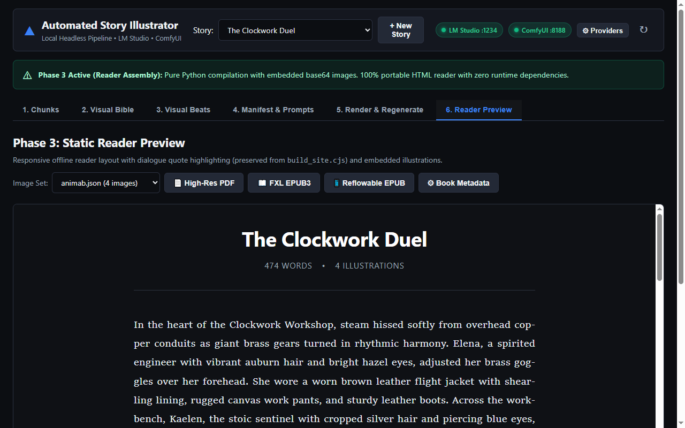

---

## Bring Your Own ComfyUI Workflow (BYOW)

You can bring **any** ComfyUI compatible workflow into the pipeline. As long as you insert our 4 wildcard tags, Automated Story Illustrator will seamlessly inject prompts and dimensions at render time.

### Step-by-Step Instructions:

1. **Export API Format from ComfyUI**:
   - In ComfyUI, click the gear icon (Settings) and check **"Enable Dev mode Options"**.
   - Click the newly visible **Save (API Format)** button to export your workflow as a `.json` file.

2. **Replace Prompts and Dimensions with Wildcard Tags**:
   Open the exported `.json` file in any text editor and replace the values with our wildcard tags:
   - **Positive Prompt**: Replace your positive prompt string with `"%PositivePrompt%"`
     *(e.g., `"text": "%PositivePrompt%"` or in Efficiency Loader `"positive": "%PositivePrompt%"`)*
   - **Negative Prompt**: Replace your negative prompt string with `"%NegativePrompt%"`
     *(e.g., `"text": "%NegativePrompt%"` or in Efficiency Loader `"negative": "%NegativePrompt%"`)*
   - **Latent Width**: Replace width with `"%Width%"`
     *(e.g., `"width": "%Width%"` or `"empty_latent_width": "%Width%"`)*
   - **Latent Height**: Replace height with `"%Height%"`
     *(e.g., `"height": "%Height%"` or `"empty_latent_height": "%Height%"`)*

3. **Drop into `workflows/`**:
   Save your file into the `workflows/` directory (e.g. `workflows/animab.json` or `workflows/my_anime_model.json`).

4. **Ready to Use**:
   Refresh or re-open the WebUI. Your workflow will instantly appear in the **ComfyUI Workflow** dropdown in Tab 5 (Render & Regenerate) and in the CLI.

> [!NOTE]
> **Strict Validation**: All 4 tags (`%PositivePrompt%`, `%NegativePrompt%`, `"%Width%"`, `"%Height%"`) are required. If any tag is missing, the system will prevent rendering and notify you with an actionable warning detailing which tags need to be added.
>
> **Random Seeds & File Tracking**: Sampler noise seeds continue to be automatically randomized across render cycles, and images are organized into dedicated directories (`images/<workflow_slug>/<chunk_id>.png`) so your image sets remain cleanly isolated and regenerable.

---

## Key Features

- **Strict Three-Phase Lifecycle**:
  - **Phase 1 (Analysis & Prompts)**: Powered by local LLMs via LM Studio (`http://localhost:1234/v1`) or custom remote API endpoints.
  - **Phase 2 (Diffusion Rendering)**: Batch rendered headless via ComfyUI WebSocket & REST API (`http://127.0.0.1:8188`) with strict wildcard tag injection.
  - **Phase 3 (Retailer Ebook & Publication Export)**: Pure Python compilation into retailer-ready High-Resolution Print PDF, Fixed-Layout FXL EPUB 3.0, Reflowable EPUB, and interactive web reader previews.
- **Prompt Context & Visual Bible Audit System**:
  - **Pre-Generation Review Matrix**: Verify character Base DNA, active timeline tags, scene attire overrides, and setting environments before generating prompts.
  - **3-Tab Inspector Modal**: Visual Bible Audit, Raw LLM Messages (system/user prompts with 1-click clipboard copy), and Scene & Model Specs.
  - **Chronological Timeline Isolation**: Physical modifications (scars, wounds, aging) are partitioned chronologically so early scenes never leak future traits.
  - **Continuity Badges & Audit Buttons**: Integrated across Tab 3, Tab 4, Tab 5, and the Tweak Modal.
- **Retailer-Compliant Ebook & Print Exports**:
  - **📄 High-Resolution Print PDF**: Formatted with vector typography, running headers, page numbers, dialogue highlighting, uncompressed image plates, and catalog metadata.
  - **📖 Fixed-Layout FXL EPUB 3.0**: Pre-paginated EPUB 3.0 with Amazon KDP / Apple Books / Kobo metadata (`rendition:layout="pre-paginated"`, `fixed-layout="true"`, `original-resolution`, `cover-image`).
  - **📱 Reflowable EPUB**: Responsive EPUB 3.0 / EPUB 2 with scalable typography and responsive figures for standard e-readers.
  - **⚙️ Ebook Retailer Metadata**: Built-in modal and API for Title, Author, Publisher, Language, ISBN, and catalog blurb.
- **Bring Your Own ComfyUI Workflow (BYOW)**:
  - Drop any ComfyUI API workflow into `workflows/` with our 4 standard wildcard tags: `%PositivePrompt%`, `%NegativePrompt%`, `"%Width%"`, `"%Height%"`.
  - Strict tag validation: immediately alerts users if required tags are missing, ensuring reliable renders without silent heuristic degradation.
- **Visual Bible Compendium & Continuity**:
  - Automatically extracts exhaustive character profiles (configurable prompts and models).
  - Multi-strategy entity resolution (exact, case-insensitive, substring, and token overlap) connects characters and locations across beats for prompt consistency.
- **5-Element Diffusion Prompt Synthesis**:
  - Synthesizes rich diffusion prompts combining: (1) Character visual appearance, (2) Action beat, (3) Setting architecture & texture, (4) Camera angle & lighting, and (5) Global art style.
- **Multi-Workflow Sets & Reader Comparison**:
  - Render alternate image sets across different workflows without overwriting existing art. Compare workflows live in the reader.
- **Interactive WebUI Dashboard**:
  - Single-page application with real-time service health monitoring for LM Studio and ComfyUI.
  - In-tab model overrides, parameter tuning, drag-and-drop story creation, manifest filtering, mass scene regeneration with checkboxes, and ebook metadata management.
- **Automated Verification Suite**:
  - Over 100 automated unit, integration, API contract, and visible browser tests verifying DOM structure, JavaScript contracts, reader styling, API endpoints, ComfyUI node injection, wildcard tag validation, PDF/EPUB export generation, and prompt context audit resolution.

---

## Directory Structure

```
.
├── webui.py                         # Top-level WebUI launcher
├── requirements.txt                 # Project Python dependencies
├── LICENSE                          # MIT License
├── README.md                        # Documentation
├── docs/                            # Documentation assets & screenshots
│   └── images/                      # Walkthrough screenshots & diagrams
├── workflows/                       # ComfyUI API workflow templates with wildcard tags
│   ├── sdxl_base.json               # SDXL base diffusion workflow
│   ├── flux_dev.json                # Flux.1 Dev diffusion workflow
│   ├── animab.json                  # Anime model workflow
│   └── !Draw.json                   # Efficiency Loader SDXL workflow
├── pipeline/                        # Core Python pipeline modules
│   ├── chunker.py                   # Deterministic regex story chunker
│   ├── llm_client.py                # LM Studio client & robust text parsers
│   ├── image_client.py              # Agnostic image generation client (ComfyUI & OpenAI-compatible)
│   ├── build_manifest.py            # Phase 1 orchestrator (Chunks -> Bible -> Beats -> Manifest -> Context Audit)
│   ├── comfy_client.py              # ComfyUI client with strict wildcard tag injection
│   ├── render_images.py             # Phase 2 batch orchestrator & rerun handler
│   ├── book_exporter.py             # Phase 3: Retailer-ready High-Res PDF, FXL EPUB3, and Reflowable EPUB
│   ├── compile_html.py              # In-dashboard web reader compiler (dialogue quote parsing)
│   ├── project_manager.py           # Project scaffolding & default configuration
│   ├── web_server.py                # Flask backend REST API & export streaming
│   └── web_static/                  # WebUI SPA frontend
│       ├── index.html               # Responsive multi-tab dashboard with Prompt Context Inspector modal
│       ├── style.css                # Dark mode styling & continuity badge CSS
│       └── app.js                   # Frontend controller (audit modals, pregen matrix, clipboard helpers)
├── projects/                        # Story project workspaces
│   └── the_clockwork_duel/          # Complete verified steampunk story project with rendered images
└── tests/                           # Complete automated test suite
    ├── test_chunker.py              # Paragraph chunking & word counting tests
    ├── test_context_detection.py    # LM Studio context size auto-detection & batching tests
    ├── test_llm_client.py           # Free-text & markdown parser tests
    ├── test_manifest_continuity.py  # Fuzzy entity resolution & continuity tests
    ├── test_timeline_continuity.py  # Character Base DNA & timeline modifications tests
    ├── test_prompt_context_audit.py # Prompt Context Audit & preview API tests
    ├── test_comfy_client.py         # Workflow parameter injection tests
    ├── test_workflow_tags.py        # Wildcard tag validation and encoding robustness
    ├── test_book_exporter.py        # PDF, FXL EPUB3, and Reflowable EPUB export tests
    ├── test_compile_html.py         # Dialogue quote & HTML styling tests
    ├── test_web_api.py              # REST API endpoint tests & export streaming
    └── test_ui_elements.py          # UI DOM, JS contracts, & E2E tests
```

---

## Prerequisites

1. **Python 3.10 or higher**: [python.org](https://www.python.org/)
2. **LM Studio**: [lmstudio.ai](https://lmstudio.ai/)
   - Start the local server at `http://localhost:1234/v1`.
   - Load any capable instruction-following model (e.g., `gemma-4-e4b-it-qat`, `thedrummer_orion-26b-a4b-v1`, `qwen2.5-7b-instruct`).
3. **ComfyUI**: [github.com/comfyanonymous/ComfyUI](https://github.com/comfyanonymous/ComfyUI)
   - Running at `http://127.0.0.1:8188`.
   - Ensure the required checkpoints for your chosen workflow are installed in `ComfyUI/models/`.
4. **Remote / Alternative Providers (Optional)**:
   - ASI is backend-agnostic: you can configure custom OpenAI-compatible API endpoints and keys for LLMs and image generation directly in the dashboard.

---

## Installation

1. **Clone the repository**:
   ```bash
   git clone https://github.com/zshortbusz/Story-Illustrator.git
   cd Story-Illustrator
   ```

2. **Create and activate a virtual environment**:
   ```bash
   python -m venv .venv
   # Windows (PowerShell):
   .venv\Scripts\Activate.ps1
   # Linux / macOS:
   source .venv/bin/activate
   ```

3. **Install dependencies**:
   ```bash
   pip install -r requirements.txt
   ```

---

## Quickstart: Interactive WebUI

Launch the web dashboard:
```bash
python webui.py
```
Open your browser to:
```
http://127.0.0.1:5000
```

### WebUI Workflow:
1. Click **+ New Story** to paste story text or drag and drop a `.txt` / `.md` file.
2. **Tab 1 (Chunks)**: Click **Run Chunker** to divide your story into scene-length paragraphs.
3. **Tab 2 (Visual Bible)**: Select your loaded LM Studio model and click **Run Extraction** to extract character profiles (Base DNA, timeline modifications, wardrobe) and setting descriptions.
4. **Tab 3 (Visual Beats)**: Click **Run Beat Selection** to select dramatic visual moments. Optionally enter scene-specific attire overrides and click **`[👁 Preview Prompt Context]`** to audit the resolved prompt context in real-time.
5. **Tab 4 (Manifest & Prompts)**: Review the **Pre-Generation Context Review Matrix** to inspect resolved character traits and setting tags before synthesis. Click **Synthesize Prompts** to generate diffusion prompts, then audit prompts with **`[🔍 Context Audit]`**.
6. **Tab 5 (Render & Regenerate)**: Select any ComfyUI workflow (`animab.json`, `sdxl_base.json`, `flux_dev.json`, etc.) and click **Start Batch Render**. Inspect generated illustrations, use checkboxes for batch regeneration, or click **`[🔍 Context]`** to verify entity traits.
7. **Tab 6 (Reader Preview & Ebook Exports)**: Read your illustrated story in dual-page or scroll mode and export commercial-ready editions:
   - **📄 High-Resolution Print PDF**: Print-ready PDF with vector typography, running headers, page numbers, dialogue highlighting, and document metadata.
   - **📖 Fixed-Layout FXL EPUB 3.0**: Pre-paginated EPUB 3.0 package with Kindle-specific metadata (`rendition:layout="pre-paginated"`, `fixed-layout="true"`, `original-resolution`, `cover-image`).
   - **📱 Reflowable EPUB**: Responsive EPUB 3.0 / EPUB 2 compatible reflowable book with scalable typography and responsive figures for standard e-readers.
   - **⚙️ Ebook Retailer Metadata**: Click **Book Metadata** to configure book title, author, publisher, language code, ISBN, and catalog blurb compliant with Amazon KDP requirements.

---

## Headless CLI Execution

For automated batch scripting, the pipeline can be run completely headless:

```bash
# Phase 1: Full Story Analysis & Prompt Synthesis
python -m pipeline.build_manifest --project ./projects/the_clockwork_duel --stage all

# Phase 2: Batch Diffusion Rendering via ComfyUI
python -m pipeline.render_images --project ./projects/the_clockwork_duel --workflow ./workflows/animab.json

# Rerun a single image with adjustments:
python -m pipeline.render_images --project ./projects/the_clockwork_duel --rerun chunk_002

# Phase 3: Export Retailer-Ready Ebooks & Publications (PDF, FXL EPUB3, Reflowable EPUB)
# Export all formats with active workflow:
python -m pipeline.book_exporter --project ./projects/the_clockwork_duel --format all

# Export specific format with custom metadata overrides:
python -m pipeline.book_exporter --project ./projects/the_clockwork_duel --format pdf --author "Author Name" --isbn "978-0-123456-47-2"

# (Optional) Compile in-dashboard web reader preview:
python -m pipeline.compile_html --project ./projects/the_clockwork_duel
```

---

## Running Tests

Run the full automated test suite:

```bash
python -m unittest discover -s tests -v
```

### Test Coverage Highlights:
- **Prompt Context Audit (`tests/test_prompt_context_audit.py`)**: Tests chronological partitioning of active vs. skipped timeline traits and REST preview endpoints.
- **Timeline Continuity (`tests/test_timeline_continuity.py`)**: Tests CharacterProfile Base DNA preservation, wardrobe tracking, and deduping across story batches.
- **Visible Chrome DevTools E2E Tests (`tests/test_ui_elements.py`)**: Live browser automation testing modal forms, tab navigation, ComfyUI batch rendering, and image pixel quality.

---

## License

This project is licensed under the [MIT License](LICENSE).
