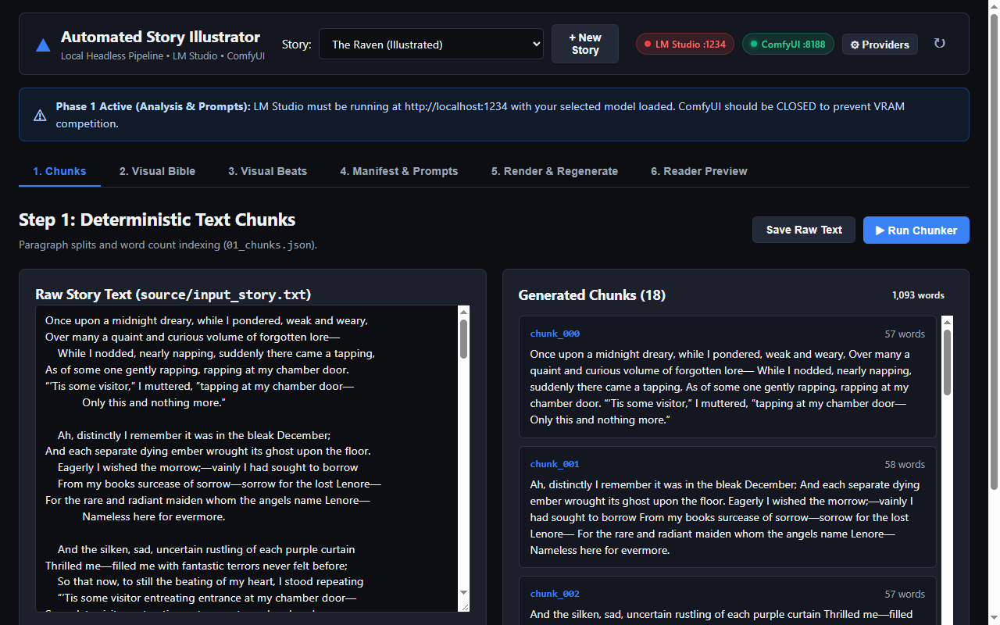
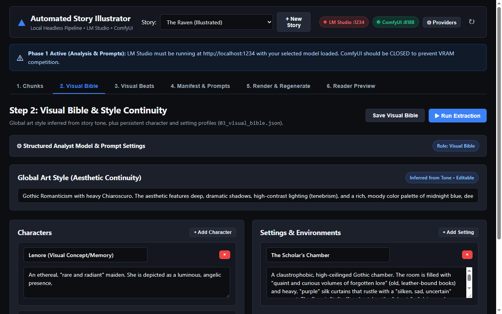
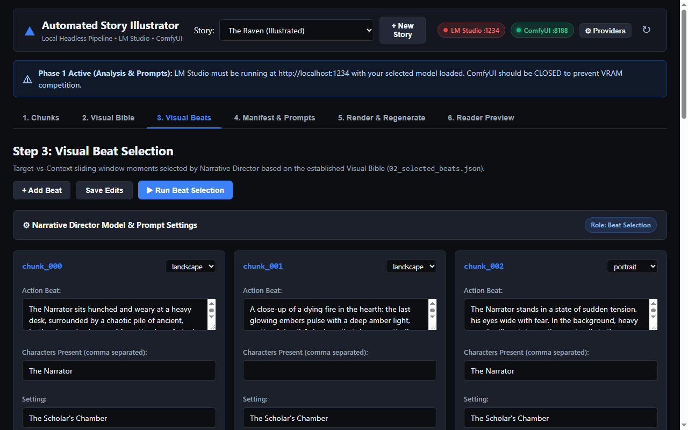
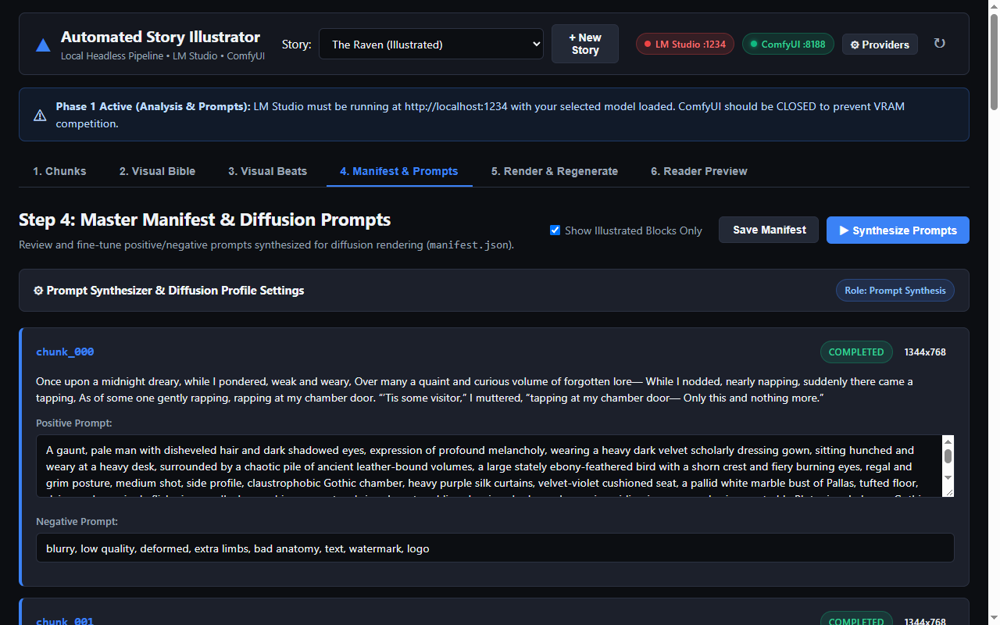
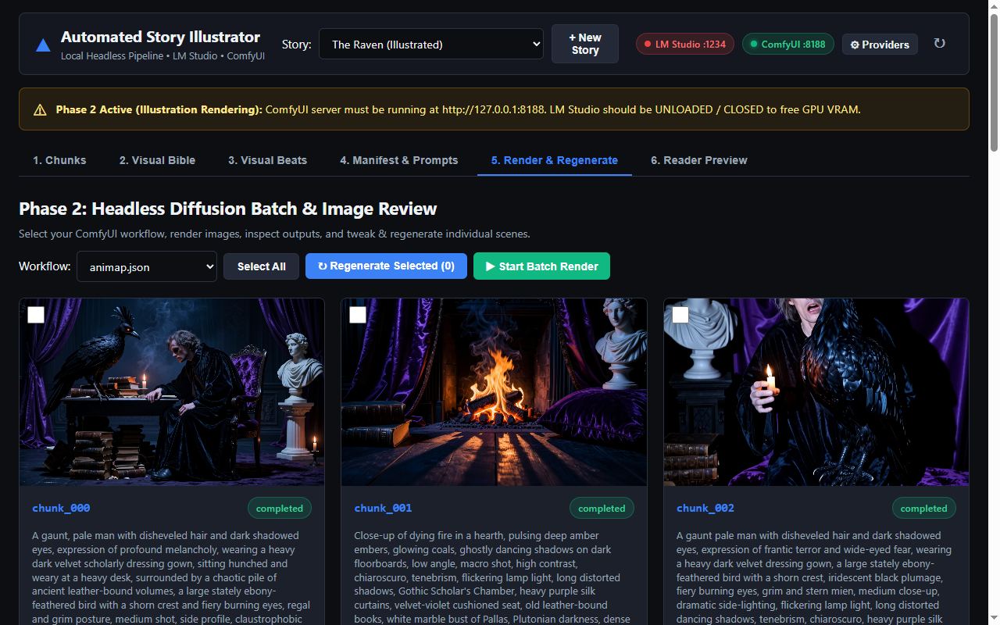
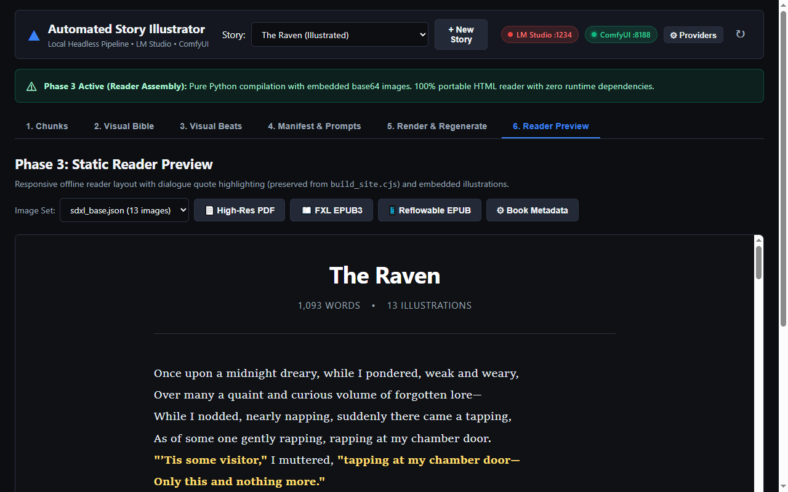

# Automated Story Illustrator (ASI)

[](https://opensource.org/licenses/MIT)
[](https://www.python.org/downloads/)
[](https://github.com/comfyanonymous/ComfyUI)
[](https://lmstudio.ai/)

**Automated Story Illustrator (ASI)** is an end-to-end local generative pipeline and interactive web dashboard that transforms raw text stories and novels into fully illustrated, beautifully formatted static web readers.

Designed specifically for consumer-grade GPU setups (such as an NVIDIA GeForce RTX 3070 with 8GB VRAM), ASI implements a strict **three-phase decoupled architecture** that separates literary analysis from diffusion rendering, guaranteeing zero GPU memory contention or VRAM Out-of-Memory (OOM) crashes.

---

## Key Features

- **Strict Three-Phase Lifecycle**:
  - **Phase 1 (Analysis & Prompts)**: Powered by local LLMs via LM Studio (`http://localhost:1234/v1`).
  - **Phase 2 (Diffusion Rendering)**: Batch rendered headless via ComfyUI WebSocket & REST API (`http://127.0.0.1:8188`).
  - **Phase 3 (Reader Assembly)**: Pure Python compilation into standalone, offline, responsive HTML readers.
- **Visual Bible Compendium & Continuity**:
  - Automatically extracts exhaustive character profiles (configurable prompts and models)
  - Multi-strategy entity resolution (exact, case-insensitive, substring, and token overlap) connects characters and locations across beats for prompt consistency.
- **5-Element Diffusion Prompt Synthesis**:
  - Synthesizes rich diffusion prompts combining: (1) Character visual appearance, (2) Action beat, (3) Setting architecture & texture, (4) Camera angle & lighting, and (5) Global art style.
  - Use your own Comfy UI workflows
- **Failure Visibility & Uncapped Thinking**:
  - Zero synthetic fallbacks: errors and empty model responses fail loudly with clear diagnostics.
  - Uncapped thinking token budget (`max_tokens: -1`) to empower modern reasoning models (e.g., DeepSeek-R1, Orion, Gemma 4, Qwen).
- **Interactive WebUI Dashboard**:
  - Single-page application with real-time service health monitoring for LM Studio and ComfyUI.
  - Hardware warning banners instructing the user when to load or unload models between phases.
  - In-tab model overrides, parameter tuning, drag-and-drop story creation, manifest filtering, and single-chunk tweak & regeneration.
- **Automated Verification Suite**:
  - 35 automated tests covering DOM structure, JavaScript contracts, reader styling, API endpoints, ComfyUI node injection, and visible Chrome DevTools E2E automation with image quality verification.

---

## System Architecture

```
                               RAW STORY (.txt / .md)
                                         │
┌────────────────────────────────────────▼────────────────────────────────────────┐
│                        PHASE 1: STORY ANALYSIS (LM Studio)                      │
│                                                                                 │
│   ┌───────────────────┐    ┌───────────────────┐    ┌───────────────────────┐   │
│   │ 1. Story Chunker  │───►│  2. Visual Bible  │───►│   3. Visual Beats     │   │
│   │ (Deterministic    │    │ (Character &      │    │  (Cinematic Scene     │   │
│   │  Regex Slicing)   │    │  Setting Profiles)│    │   Beat Selection)     │   │
│   └───────────────────┘    └───────────────────┘    └───────────┬───────────┘   │
│                                                                 │               │
│                                                                 ▼               │
│                                                     ┌───────────────────────┐   │
│                                                     │ 4. Prompt Synthesis   │   │
│                                                     │ (Master manifest.json)│   │
│                                                     └───────────────────────┘   │
└────────────────────────────────────────┬────────────────────────────────────────┘
                                         │
                                         ▼
┌─────────────────────────────────────────────────────────────────────────────────┐
│                     PHASE 2: DIFFUSION BATCH (ComfyUI)                          │
│                                                                                 │
│   - Headless WebSocket execution tracking & REST job dispatch                   │
│   - Automatic node parameter injection (prompt, negative, width, height, seed)  │
│   - Compatible with SDXL diffusion workflows (custom workflows supported)       │
│   - Atomic manifest checkpointing and single-chunk tweak & rerun                │
└────────────────────────────────────────┬────────────────────────────────────────┘
                                         │
                                         ▼
┌─────────────────────────────────────────────────────────────────────────────────┐
│                    PHASE 3: STATIC READER ASSEMBLY (Python)                     │
│                                                                                 │
│   - Pure Python zero-footprint compilation (no GPU / no server required)        │
│   - Dialogue quote highlighting (<strong class="q">) and embedded figures       │
│   - Generates standalone, dark-mode, mobile-responsive index.html               │
└─────────────────────────────────────────────────────────────────────────────────┘
```

---

## Directory Structure

```
.
├── webui.py                         # Top-level WebUI launcher
├── requirements.txt                 # Project Python dependencies
├── LICENSE                          # MIT License
├── README.md                        # Documentation
├── workflows/                       # ComfyUI API workflow templates with wildcard tags
│   ├── sdxl_base.json               # SDXL base diffusion workflow
│   ├── flux_dev.json                # Flux.1 Dev diffusion workflow
│   ├── animap.json                  # Anime model workflow
│   └── !Draw.json                   # Efficiency Loader SDXL workflow
├── pipeline/                        # Core Python pipeline modules
│   ├── chunker.py                   # Deterministic regex story chunker
│   ├── llm_client.py                # LM Studio client & robust text parsers
│   ├── build_manifest.py            # Phase 1 orchestrator (Chunks -> Bible -> Beats -> Manifest)
│   ├── comfy_client.py              # ComfyUI client with strict wildcard tag injection
│   ├── render_images.py             # Phase 2 batch orchestrator & rerun handler
│   ├── compile_html.py              # Phase 3 reader compiler (dialogue quote parsing)
│   ├── book_exporter.py             # Retailer-ready High-Res PDF, FXL EPUB3, and Reflowable EPUB
│   ├── project_manager.py           # Project scaffolding & default configuration
│   ├── web_server.py                # Flask backend REST API & export streaming
│   └── web_static/                  # WebUI SPA frontend
│       ├── index.html               # Responsive multi-tab dashboard with ebook exports & metadata
│       ├── style.css                # Dark mode styling & responsive layout
│       └── app.js                   # Frontend controller
├── projects/                        # Story project workspaces
│   └── the_raven/                   # Sample illustrated classic story project
└── tests/                           # Complete automated test suite
    ├── test_chunker.py              # Paragraph chunking & word counting tests
    ├── test_context_detection.py    # LM Studio context size auto-detection & batching tests
    ├── test_llm_client.py           # Free-text & markdown parser tests
    ├── test_manifest_continuity.py  # Fuzzy entity resolution & continuity tests
    ├── test_comfy_client.py         # Workflow parameter injection tests
    ├── test_workflow_tags.py        # Wildcard tag validation and encoding robustness
    ├── test_book_exporter.py        # PDF, FXL EPUB3, and Reflowable EPUB export tests
    ├── test_compile_html.py         # Dialogue quote & HTML styling tests
    ├── test_web_api.py              # REST API endpoint tests & export streaming
    └── test_ui_elements.py          # UI DOM, JS contracts, & E2E tests
```

---

## Prerequisites

1. **Python 3.10 or higher**: [python.org](https://www.python.org/)
2. **LM Studio**: [lmstudio.ai](https://lmstudio.ai/)
   - Start the local server at `http://localhost:1234/v1`.
   - Load any capable instruction-following model (e.g., `gemma-4-e4b-it-qat`, `thedrummer_orion-26b-a4b-v1`, `qwen2.5-7b-instruct`).
3. **ComfyUI**: [github.com/comfyanonymous/ComfyUI](https://github.com/comfyanonymous/ComfyUI)
   - Running at `http://127.0.0.1:8188`.
   - Ensure the required checkpoints for your chosen workflow are installed in `ComfyUI/models/`.
4. ADDED SUPPORT FOR OTHER PROVIDERS.

---

## Installation

1. **Clone the repository**:
   ```bash
   git clone https://github.com/zshortbusz/Story-Illustrator.git
   cd Story-Illustrator
   ```

2. **Create and activate a virtual environment**:
   ```bash
   python -m venv .venv
   # Windows (PowerShell):
   .venv\Scripts\Activate.ps1
   # Linux / macOS:
   source .venv/bin/activate
   ```

3. **Install dependencies**:
   ```bash
   pip install -r requirements.txt
   ```

---

## Quickstart: Interactive WebUI

Launch the web dashboard:
```bash
python webui.py
```
Open your browser to:
```
http://127.0.0.1:5000
```

### WebUI Workflow:
1. Click **+ New Story** to paste story text or drag and drop a `.txt` / `.md` file.
2. **Tab 1 (Chunks)**: Click **Run Chunker** to divide your story into scene-length paragraphs.
3. **Tab 2 (Visual Bible)**: Select your loaded LM Studio model and click **Run Extraction** to extract character and setting profiles.
4. **Tab 3 (Visual Beats)**: Click **Run Beat Selection** to select dramatic visual moments.
5. **Tab 4 (Manifest & Prompts)**: Click **Synthesize Prompts** to generate diffusion prompts. Review or fine-tune prompts, and optionally configure positive prompt prefixes per profile/workflow.
6. **Tab 5 (Render & Regenerate)**: Select any ComfyUI workflow (`sdxl_base.json`, `flux_dev.json`, `animap.json`, or your own custom workflow) and click **Start Batch Render**. Inspect generated illustrations, mass-select scenes with checkboxes for batch regeneration, or switch workflows to generate alternate model image sets without losing previous generations.
7. **Tab 6 (Reader Preview & Ebook Exports)**: Switch between your generated workflow image sets to compare illustrations. Export retailer-ready ebooks directly:
   - **📄 High-Resolution Print PDF**: Print-ready PDF generated with vector typography, running headers, page numbers, dialogue quote highlighting, uncompressed full-res image plates, and document catalog metadata (`Title`, `Author`, `Subject`, `Creator`).
   - **📖 Fixed-Layout FXL EPUB 3.0**: Pre-paginated EPUB 3.0 package with Kindle-specific metadata (`rendition:layout="pre-paginated"`, `fixed-layout="true"`, `original-resolution`, `cover-image`, `nav.xhtml`, `toc.ncx`), ideal for illustrated fiction, graphic novels, and children's books.
   - **📱 Reflowable EPUB**: Responsive EPUB 3.0 / EPUB 2 compatible reflowable book with scalable typography, responsive `<figure>` illustrations, and full retailer metadata for Kindle Paperwhite, Apple Books, and Kobo.
   - **⚙️ Ebook Retailer Metadata**: Click **Book Metadata** to configure book title, author, publisher, language code, ISBN, and catalog blurb compliant with Amazon KDP and ebook retailers.


---

## Visual Tour & Tab-by-Tab Guide (The Raven Example)

Below is a complete visual walkthrough of the 6-stage pipeline using Edgar Allan Poe's *The Raven* as an example project. Each tab in the WebUI allows you to inspect, curate, and control every phase of the creative and rendering process.

### Tab 1: Chunk Your Story into Digestible Bites
Divide your manuscript or raw story text into scene-length paragraphs with smart word count limits and boundary preservation.
- **Inspect & Adjust**: Review each chunk (`chunk_000`, `chunk_001`, etc.), check word counts, and verify clean scene division.
- **Customizable**: Tweak the target word count per chunk or customize the scene-breaker regex at any time.



---

### Tab 2: Create a Visual Bible (Curate Before the Next Step)
Extract comprehensive character descriptions, key settings, and global art motifs using your local LLM via LM Studio.
- **Canonical Profiles**: Automatically captures character facial features, hair, clothing, age, and setting architectural details.
- **Curate Before Proceeding**: Directly edit or expand character descriptions and location palettes before moving to beat selection, ensuring strict visual continuity across the entire story.



---

### Tab 3: Identify Visual Beats (Dramatic Narrative Moments)
Scan through each chunk to pinpoint the single most cinematic, illustrative moment.
- **Dramatic Selection**: The LLM analyzes each story segment to select the strongest visual beat—identifying active characters, primary location, mood, and focal action.
- **Curate & Refine**: Review each beat's narrative summary, characters present, and mood tags. Refine any beat description to focus on your preferred dramatic angle.



---

### Tab 4: Synthesize Prompts & Build the Master Manifest
Blend entity profiles from your Visual Bible with the dynamic action of your Visual Beats into rich 5-element diffusion prompts.
- **5-Element Synthesis**: Prompts combine Character Appearance + Scene Action + Setting Architecture + Camera/Lighting + Art Style.
- **Prefixes & Customization**: Configure global or per-profile positive/negative prompt prefixes (e.g. style LoRA triggers or artist styles) and review the final prompts before rendering.



---

### Tab 5: Batch Render & Review with ComfyUI
Dispatch prompts directly to ComfyUI headless via WebSocket and monitor real-time generation progress.
- **Multi-Workflow Support**: Render using any ComfyUI workflow (`sdxl_base.json`, `flux_dev.json`, `animap.json`, or your own custom BYOW workflow). Images are saved into isolated workflow directories.
- **Review & Batch Regenerate**: Inspect generated illustrations alongside chunk text, use checkboxes for one-click batch regeneration with fresh random seeds, or re-render individual scenes with tweaked prompts.



---

### Tab 6: Reader Preview, Image Set Comparison & Retailer Ebook Exports
Enjoy your fully illustrated book in an interactive dual-page or scroll reader, compare workflow renders side-by-side, and export commercial-grade ebooks.
- **Interactive Reader**: Read your illustrated story with typography-curated dialogue quote highlighting (`<strong class="q">`) and inline high-resolution illustrations.
- **Workflow Comparison**: Switch between different workflow image sets on the fly to compare art styles across the entire book.
- **Retailer-Ready Exports**:
  - **📄 High-Resolution Print PDF**: Vector typography, running headers, page numbers, dialogue highlighting, uncompressed full-res image plates, and document catalog metadata.
  - **📖 Fixed-Layout FXL EPUB 3.0**: Pre-paginated EPUB 3.0 package with Kindle-specific metadata (`rendition:layout="pre-paginated"`, `fixed-layout="true"`, `original-resolution`, `cover-image`), ideal for illustrated fiction and graphic novels.
  - **📱 Reflowable EPUB**: Responsive EPUB 3.0 / EPUB 2 compatible reflowable book with scalable typography and responsive figures for standard e-readers.
  - **⚙️ Ebook Retailer Metadata**: Click **Book Metadata** to configure book title, author, publisher, language code, ISBN, and catalog blurb compliant with Amazon KDP requirements.



---

## Bring Your Own ComfyUI Workflow (BYOW)

You can bring **any** ComfyUI compatible workflow into the pipeline. As long as you insert our 4 wildcard tags, Automated Story Illustrator will seamlessly inject prompts and dimensions at render time.

### Step-by-Step Instructions:

1. **Export API Format from ComfyUI**:
   - In ComfyUI, click the gear icon (Settings) and check **"Enable Dev mode Options"**.
   - Click the newly visible **Save (API Format)** button to export your workflow as a `.json` file.

2. **Replace Prompts and Dimensions with Wildcard Tags**:
   Open the exported `.json` file in any text editor and replace the values with our wildcard tags:
   - **Positive Prompt**: Replace your positive prompt string with `"%PositivePrompt%"`
     *(e.g., `"text": "%PositivePrompt%"` or in Efficiency Loader `"positive": "%PositivePrompt%"`)*
   - **Negative Prompt**: Replace your negative prompt string with `"%NegativePrompt%"`
     *(e.g., `"text": "%NegativePrompt%"` or in Efficiency Loader `"negative": "%NegativePrompt%"`)*
   - **Latent Width**: Replace width with `"%Width%"`
     *(e.g., `"width": "%Width%"` or `"empty_latent_width": "%Width%"`)*
   - **Latent Height**: Replace height with `"%Height%"`
     *(e.g., `"height": "%Height%"` or `"empty_latent_height": "%Height%"`)*

3. **Drop into `workflows/`**:
   Save your file into the `workflows/` directory (e.g. `workflows/my_anime_model.json`).

4. **Ready to Use**:
   Refresh or re-open the WebUI. Your workflow will instantly appear in the **ComfyUI Workflow** dropdown in Tab 5 (Render & Regenerate) and in the CLI.

> [!NOTE]
> **Strict Validation**: All 4 tags (`%PositivePrompt%`, `%NegativePrompt%`, `"%Width%"`, `"%Height%"`) are required. If any tag is missing, the system will prevent rendering and notify you with an actionable warning detailing which tags need to be added.
>
> **Random Seeds & File Tracking**: Sampler noise seeds continue to be automatically randomized across render cycles, and images are organized into dedicated directories (`images/<workflow_slug>/<chunk_id>.png`) so your image sets remain cleanly isolated and regenerable.

---

## Headless CLI Execution

For automated batch scripting, the pipeline can be run completely headless:

```bash
# Phase 1: Full Story Analysis & Prompt Synthesis
python -m pipeline.build_manifest --project ./projects/the_raven --stage all

# Phase 2: Batch Diffusion Rendering via ComfyUI
python -m pipeline.render_images --project ./projects/the_raven --workflow ./workflows/sdxl_base.json

# Rerun a single image with adjustments:
python -m pipeline.render_images --project ./projects/the_raven --rerun chunk_000

# Phase 3: Compile Portable Standalone Reader (Embeds base64 images into a single self-contained HTML file)
python -m pipeline.compile_html --project ./projects/the_raven

# Or compile with relative image paths:
python -m pipeline.compile_html --project ./projects/the_raven --no-embed
```

---

## Running Tests

Run the full automated test suite (all 44 unit, contract, API, context detection, and visible browser E2E tests):

```bash
python -m unittest discover -s tests -v
```

### Visible Chrome DevTools E2E Tests:
The UI test suite in `tests/test_ui_elements.py` includes a live browser test that drives Google Chrome in a visible window using the Chrome DevTools protocol, verifying modal forms, tab navigation, end-to-end story generation, ComfyUI rendering, and image pixel quality:

```bash
python -m unittest tests/test_ui_elements.py -v
```

*(Note: Chrome DevTools tests automatically skip gracefully if `chrome-devtools-mcp` is not installed).*

---

## License

This project is licensed under the [MIT License](LICENSE).
